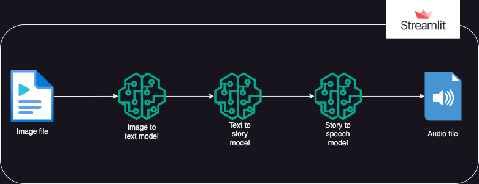
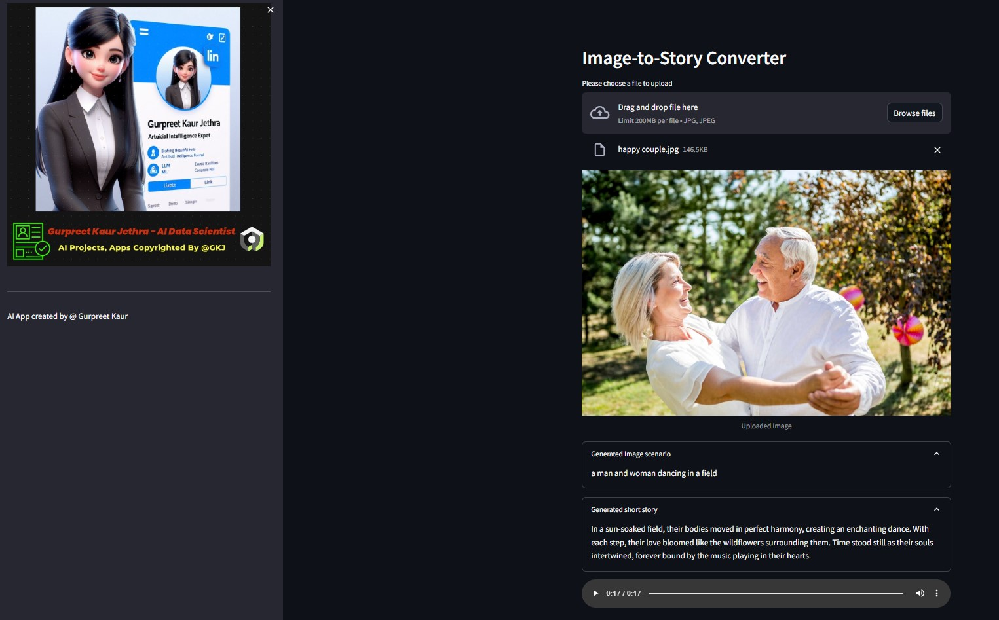
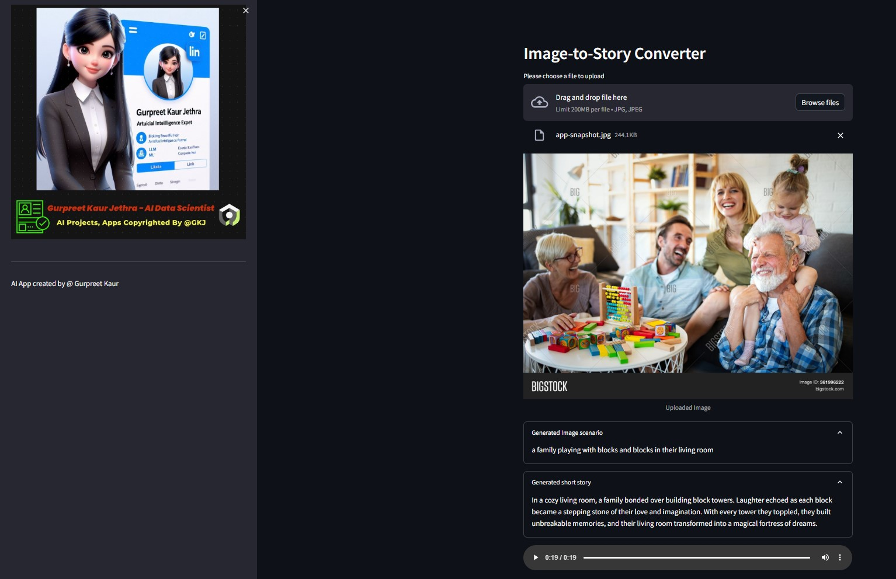
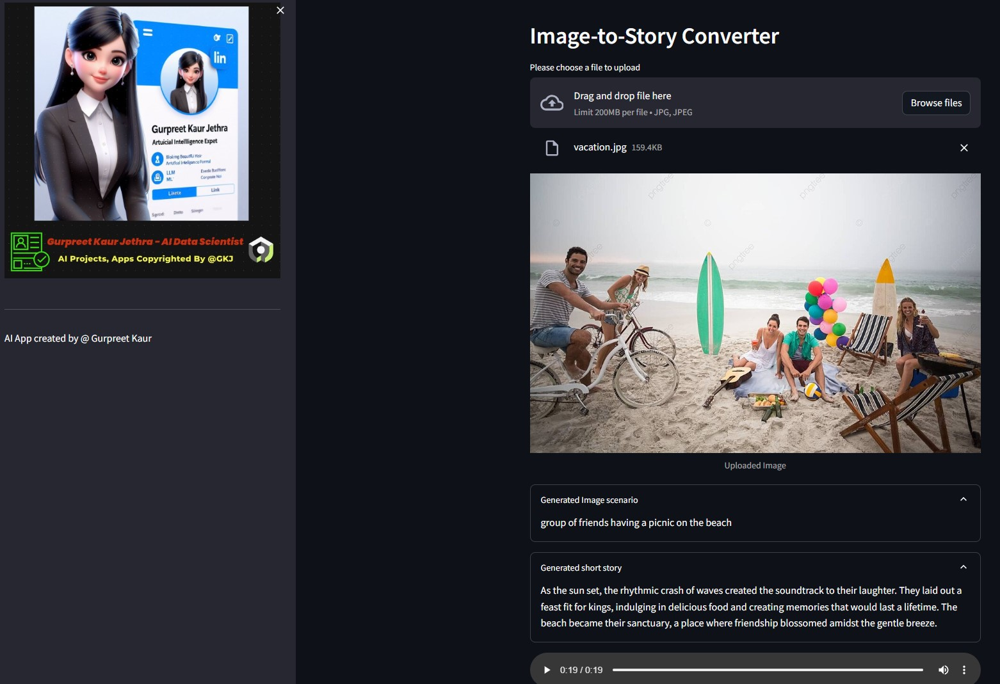

# Image to Speech — GenAI App by Adithyaa S Kumar

A generative AI pipeline that takes an uploaded image and produces a narrated audio story. Built with HuggingFace Transformers, Groq LLM, and Streamlit.

---

## How It Works

The app runs a three-stage pipeline:

1. **Image → Caption** — [Salesforce BLIP](https://huggingface.co/Salesforce/blip-image-captioning-base) generates a text description of the uploaded image locally using HuggingFace Transformers.
2. **Caption → Story** — [Groq](https://groq.com/) runs `llama-3.3-70b-versatile` to write a short story (max 50 words) based on the caption.
3. **Story → Audio** — `pyttsx3` converts the story to a narrated WAV audio file, fully offline.



---

## Demo

| Input Image | Output |
|---|---|
|  | Audio in `img-audio/CoupleAudio.wav` |
|  | Audio in `img-audio/FamilyAudio.wav` |
|  | Audio in `img-audio/PicnicAudio.wav` |

---

## Tech Stack

| Layer | Technology |
|---|---|
| UI | Streamlit |
| Image Captioning | Salesforce BLIP (`blip-image-captioning-base`) |
| Story Generation | Groq API — LLaMA 3.3 70B |
| Text-to-Speech | pyttsx3 (offline) |
| Environment | python-dotenv |

---

## Setup

### 1. Clone the repo

```bash
git clone https://github.com/your-username/image-to-speech.git
cd image-to-speech
```

### 2. Install dependencies

```bash
pip install -r requirements.txt
```

### 3. Configure API keys

Copy `.env.example` to `.env` and fill in your keys:

```bash
cp .env.example .env
```

```env
GROQ_API_KEY=your-groq-api-key
HUGGINGFACE_API_TOKEN=your-huggingface-token
```

- Groq API key: [console.groq.com](https://console.groq.com)
- HuggingFace token: [huggingface.co/settings/tokens](https://huggingface.co/settings/tokens)

### 4. Run the app

```bash
streamlit run app.py
```

The app will open at `http://localhost:8501`. Upload a `.jpg` image and the pipeline runs automatically.

---

## Project Structure

```
├── app.py               # Main Streamlit app
├── utils/
│   └── custom.py        # Custom CSS
├── img/                 # System design diagram
├── img-audio/           # Sample demo outputs
├── .env.example         # Environment variable template
└── requirements.txt     # Python dependencies
```

---

## License

Distributed under the MIT License. See `LICENSE` for details.
